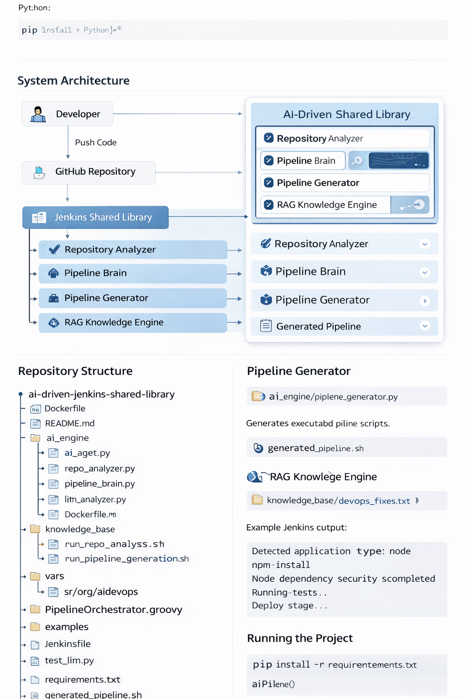
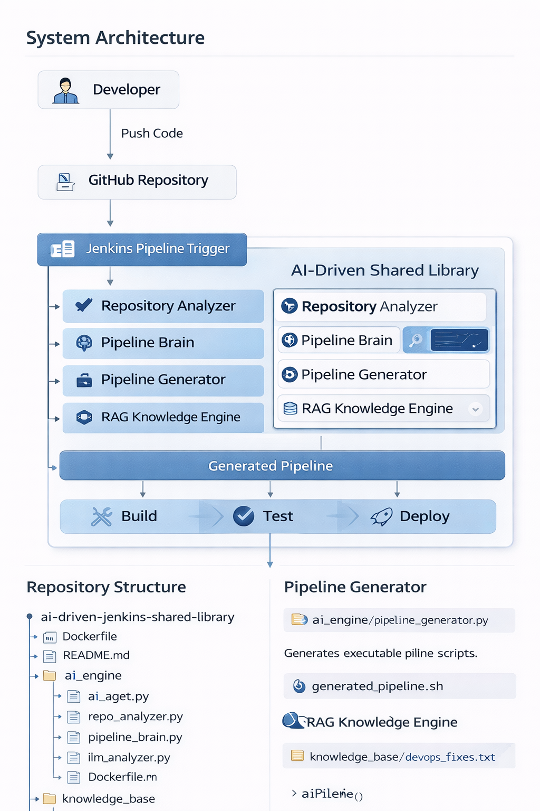

# AI-Driven Jenkins Shared Library for CI/CD Automation



---

# Overview

This project implements an **AI-driven Jenkins Shared Library** that automatically analyzes a repository and generates the appropriate CI/CD pipeline.

The system uses:

- Repository analysis
- AI pipeline decision engine
- Prompt templates
- RAG knowledge base

The goal is to build **self-driving DevOps pipelines** where onboarding a new application requires minimal manual configuration.

---

# System Architecture



```
Developer
   │
   │ Push Code
   ▼
GitHub Repository
   │
   ▼
Jenkins Pipeline Trigger
   │
   ▼
AI-Driven Shared Library
   │
   ├── Repository Analyzer
   ├── Pipeline Brain
   ├── Pipeline Generator
   └── RAG Knowledge Engine
   │
   ▼
Generated Pipeline
   │
   ▼
Build → Test → Deploy
```

---

# Repository Structure

```
ai-driven-jenkins-shared-library
│
├── Dockerfile
├── README.md
│
├── ai_engine
│   ├── ai_agent.py
│   ├── repo_analyzer.py
│   ├── pipeline_brain.py
│   ├── pipeline_generator.py
│   ├── log_analyzer.py
│   ├── llm_client.py
│   ├── rag_engine.py
│   │
│   └── prompts
│        ├── repo_analysis_prompt.txt
│        ├── pipeline_generation_prompt.txt
│        └── failure_analysis_prompt.txt
│
├── knowledge_base
│   └── devops_fixes.txt
│
├── scripts
│   ├── run_repo_analysis.sh
│   └── run_pipeline_generation.sh
│
├── vars
│   └── aiPipeline.groovy
│
├── src/org/aidevops
│   └── PipelineOrchestrator.groovy
│
├── examples
│   ├── Jenkinsfile
│   │
│   └── pipeline_logs
│       ├── java_pipeline_execution.txt
│       └── node_pipeline_execution.txt
│
├── tests
│   └── test_llm.py
│
├── requirements.txt
│
├── generated_pipeline.sh      # dynamically generated pipeline script
├── analysis.json              # repository analysis output
└── failure.log                # pipeline failure logs used for AI analysis
```

---

# AI Engine Components

## Repository Analyzer

File:

```
ai_engine/repo_analyzer.py
```

Responsible for analyzing repository structure and detecting:

- programming language
- build tools
- deployment configuration

Example detection:

```
requirements.txt → Python
pom.xml → Java
package.json → NodeJS
Dockerfile → Docker build
```

---

# Pipeline Decision Engine

File:

```
ai_engine/pipeline_brain.py
```

Determines the CI/CD stages required based on repository metadata.

Example decisions:

| Detection | Pipeline Action |
|-----------|----------------|
Python project | pip install |
Java project | mvn build |
Node project | npm install |
Dockerfile | docker build |
Terraform | terraform apply |

---

# Pipeline Generator

File:

```
ai_engine/pipeline_generator.py
```

Generates executable pipeline scripts.

Output file:

```
generated_pipeline.sh
```

---

# RAG Knowledge Engine

The system uses **Retrieval Augmented Generation (RAG)** to improve pipeline decisions.

Knowledge base:

```
knowledge_base/devops_fixes.txt
```

The RAG engine retrieves relevant DevOps knowledge before generating pipeline actions.

---

# Jenkins Shared Library

The reusable pipeline entry point:

```
vars/aiPipeline.groovy
```

Usage example:

```groovy
@Library('ai-driven-jenkins-shared-library') _
aiPipeline()
```

---

# Pipeline Workflow


```
Repository Checkout
       │
       ▼
Repository Analysis
       │
       ▼
Pipeline Decision Engine
       │
       ▼
Pipeline Generation
       │
       ▼
Generated Pipeline Script
       │
       ▼
Pipeline Execution
```

---

# Example Execution

Example application analyzed:

```
Node.js Application
```

Detected file:

```
package.json
```

Generated pipeline step:

```
npm install
```

Example Jenkins output:

```
Detected application type: node
npm install
Node dependency security scan completed
Running tests...
Deploy stage...
BUILD SUCCESS
```

---

# Running the Project

## Install Dependencies

```
pip install -r requirements.txt
```

---

## Run Repository Analysis

```
bash scripts/run_repo_analysis.sh
```

---

## Generate Pipeline

```
bash scripts/run_pipeline_generation.sh
```

---

# Jenkins Setup

Configure the shared library:

```
Manage Jenkins
→ Configure System
→ Global Pipeline Libraries
```

Configuration:

```
Name: ai-driven-jenkins-shared-library
Version: master
Repository:
https://github.com/dkasha14/ai-driven-jenkins-shared-library.git
```

---

# Example Jenkinsfile

```
@Library('ai-driven-jenkins-shared-library') _
aiPipeline()
```

Example Pipeline Logs

Example Jenkins pipeline executions are stored in:
examples/pipeline_logs/
Files included:

java_pipeline_execution.txt → Example run for a Java Spring Boot application

node_pipeline_execution.txt → Example run for a Node.js application

These logs show how the AI-driven shared library automatically detects repository type and runs the appropriate pipeline steps.

---

# Future Enhancements

- Docker image build automation
- Kubernetes deployment automation
- Terraform infrastructure pipelines
- DevSecOps security scanning
- AI-driven incident remediation

---

# Project Vision

This project demonstrates an **AI-powered DevOps automation platform** capable of dynamically generating CI/CD pipelines based on repository analysis.

The long-term goal is to enable **autonomous DevOps pipelines**.
